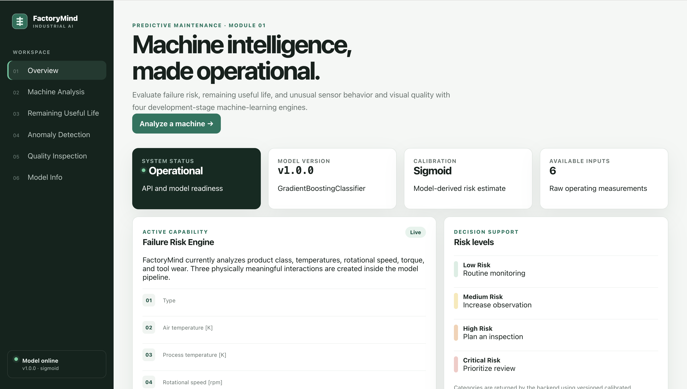
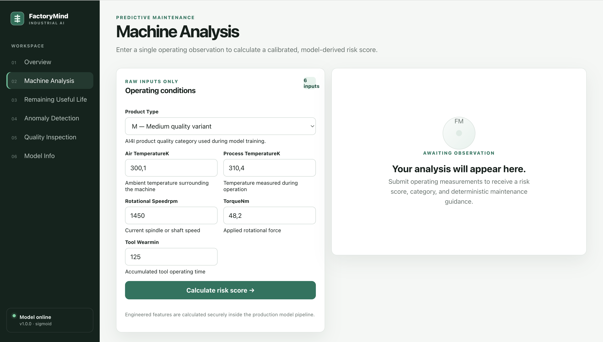
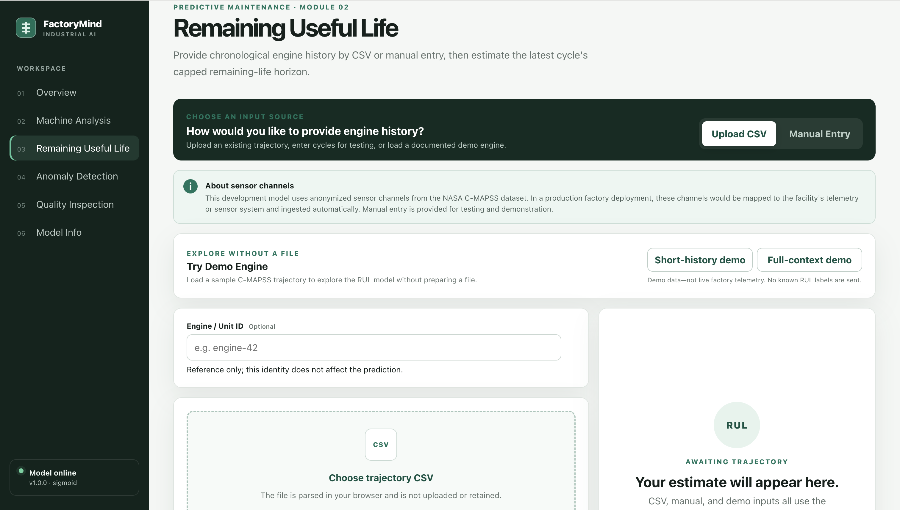
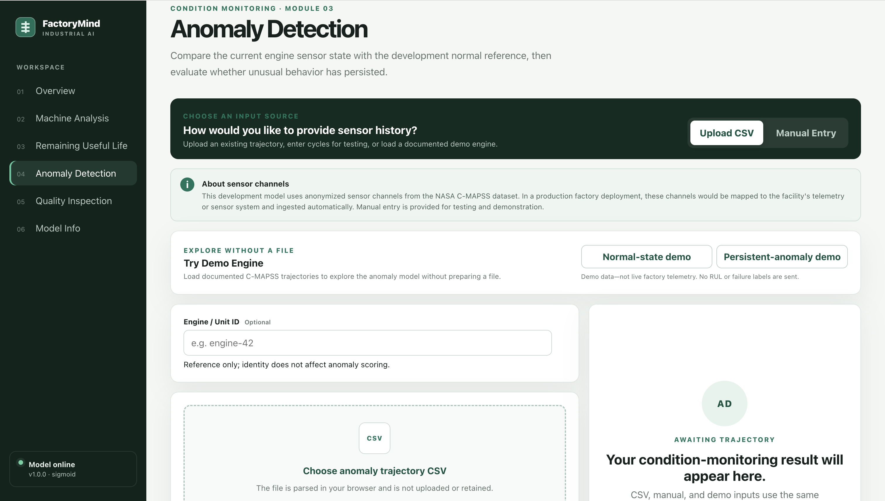
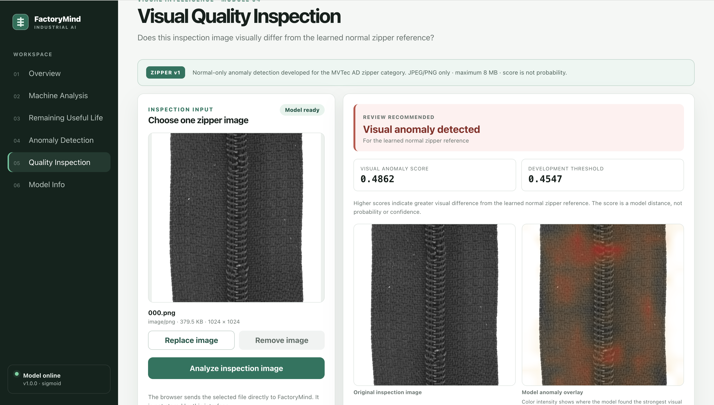
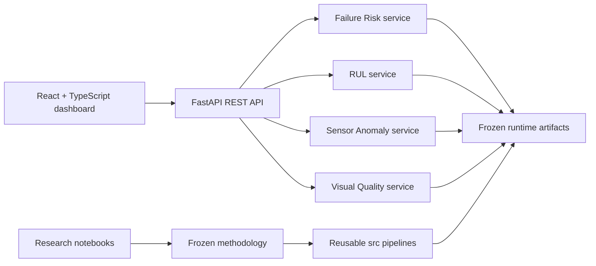

# FactoryMind AI

git status

An end-to-end industrial AI platform for machine failure risk, remaining useful life estimation, sensor anomaly detection, and visual quality inspection. FactoryMind combines reproducible machine-learning pipelines with a guarded FastAPI backend and a React + TypeScript dashboard.

**Python 3.13 · FastAPI · scikit-learn · PyTorch · React · TypeScript · Vite**



## At a glance

| Module                    | Purpose                                                               | Dataset                   | Production approach                                   | Status      |
| ------------------------- | --------------------------------------------------------------------- | ------------------------- | ----------------------------------------------------- | ----------- |
| Failure Risk              | Score one machine observation and assign an operational risk category | UCI AI4I 2020             | Sigmoid-calibrated Gradient Boosting                  | Operational |
| Remaining Useful Life     | Estimate capped RUL from an engine trajectory                         | NASA C-MAPSS FD001        | Random Forest with backward-looking temporal features | Operational |
| Sensor Anomaly Detection  | Detect unusual sensor states and persistent alerts                    | NASA C-MAPSS FD001        | StandardScaler + Isolation Forest                     | Operational |
| Visual Quality Inspection | Identify visual differences from a learned normal zipper reference    | MVTec AD, zipper category | PatchCore-style nearest-neighbor anomaly detection    | Operational |

The project demonstrates the complete path from exploratory research and feature engineering to frozen inference code, versioned artifacts, REST contracts, interactive workflows, automated tests, and responsible communication of model limitations.

## ML modules

### 1. Failure Risk

The failure module predicts the binary **Machine failure** target from six legitimate operational inputs: product type, air temperature, process temperature, rotational speed, torque, and tool wear. Identifiers, the target, and the TWF/HDF/PWF/OSF/RNF failure-mode labels are excluded from inference.

The production pipeline adds three deterministic features:

- temperature difference: process temperature minus air temperature
- power proxy: rotational speed × torque
- mechanical strain proxy: torque × tool wear

A `GradientBoostingClassifier` is wrapped in five-fold sigmoid calibration. Its output is used as a calibrated, model-derived risk estimate—not as a guaranteed real-world probability of future failure.

| Risk category | Calibrated-score interval | Provisional policy objective                        |
| ------------- | ------------------------: | --------------------------------------------------- |
| Low           |               below 4.27% | Below the screening boundary                        |
| Medium        |     4.27% to below 23.89% | Highest precision while recall remains at least 90% |
| High          |    23.89% to below 40.83% | Highest recall while precision remains at least 90% |
| Critical      |          40.83% and above | Highest recall while precision remains at least 95% |

The exact thresholds were derived from out-of-fold training predictions. The project holdout had already been examined during earlier model development, so it is documented as development-exposed rather than an untouched lockbox.



### 2. Remaining Useful Life

The RUL module uses NASA C-MAPSS **FD001** engine-unit sequences. It retains 14 informative sensor channels and requires the three operating settings for input-schema integrity. Six sensors receive backward-looking lag, trailing-window, rolling-standard-deviation, and delta features, producing a frozen **47-predictor** contract.

The final estimator is a 200-tree `RandomForestRegressor`. All temporal features use the current or earlier observations; no future cycle enters inference.

- The training target is capped at **125 cycles**.
- A result displayed as **125+** represents a long-horizon healthy/early-life region, not an exact 125-cycle forecast.
- One to five supplied cycles are still scoreable through the trained imputation pipeline and are labelled **Limited History**.
- Full temporal context begins at six consecutive cycles.
- Near failure, the model can overestimate remaining life; no calibrated uncertainty interval is available.



### 3. Sensor Anomaly Detection

The anomaly module consumes the same FD001 trajectory domain through a separate frozen **14-sensor** contract. Its development normal reference contains 8,031 training observations whose retrospective raw RUL is greater than 125 cycles.

The workflow applies `StandardScaler` followed by a 300-tree `IsolationForest`:

- higher scores mean greater unusualness relative to the development normal reference
- the displayed empirical percentile is a rank within the reference score distribution, not a probability
- the raw alert boundary is the **97.5th percentile** (`0.5197165`)
- a persistent alert requires at least **3 exceedances among the latest 5 cycles**
- fewer than five cycles can be scored, but persistence is reported as unavailable

An anomaly is an investigation signal. It does not by itself prove degradation or failure.



### 4. Visual Quality Inspection

The visual module is limited to the **MVTec AD zipper** research category. It learns from normal reference images and performs PatchCore-style anomaly detection:

- frozen ImageNet ResNet18 backbone
- combined `layer2` and `layer3` features
- 16 × 16 patch grid with 384-dimensional normalized embeddings
- 49,152 full reference patches
- deterministic 5% coreset containing 2,458 patches
- Euclidean nearest-neighbor patch distances
- image score equal to the maximum of 256 patch distances
- 97.5th-percentile development-normal threshold: **0.454687**

The dashboard renders the original upload beside a threshold-aware **Model anomaly overlay**. The model does not classify defect type or severity, return a probability, confirm a defect boundary, or provide certified quality control.



## Development results

These are public-dataset research and development benchmarks, not evidence of real-factory generalization.

### Failure Risk

| Metric            | Development holdout |
| ----------------- | ------------------: |
| ROC-AUC           |              0.9648 |
| Average precision |              0.9063 |
| Brier score       |             0.00615 |
| Log loss          |             0.03111 |

### Remaining Useful Life

| Evaluation                        |  RMSE |   MAE |     R² | NASA score |
| --------------------------------- | ----: | ----: | -----: | ---------: |
| Grouped development CV, mean      | 16.36 | 11.10 | 0.8456 |          — |
| Official FD001 endpoint benchmark | 17.54 | 13.03 | 0.8084 |     522.95 |
| Near failure, raw RUL ≤ 30        | 14.18 |  8.84 |      — |          — |

Near-failure mean signed error is **+7.00 cycles** (`prediction − actual`), documenting the model's tendency to overestimate in that region. The official FD001 test set became development-exposed after evaluation.

### Sensor Anomaly Detection

FD001 has no externally validated anomaly labels, so supervised accuracy is not reported. Repeated development diagnostics found:

| Heuristic diagnostic                        |         Result |
| ------------------------------------------- | -------------: |
| Healthy-reference observation alert burden  |  2.85% ± 1.03% |
| Critical-region observation alert coverage  | 99.65% ± 0.42% |
| Critical-engine persistent-alert coverage   |           100% |
| Mean median retrospective lead-time finding |    59.8 cycles |

These values characterize the selected heuristic; they are not independent anomaly-detection validation.

### Visual Quality Inspection

| Level | ROC-AUC | Average precision | Precision | Recall |     F1 |
| ----- | ------: | ----------------: | --------: | -----: | -----: |
| Image |  0.9480 |            0.9842 |    0.9339 | 0.9496 | 0.9417 |
| Pixel |  0.9716 |            0.4479 |         — |      — |      — |

At the frozen image threshold, the benchmark confusion matrix contains 24 TN, 8 FP, 6 FN, and 113 TP. Compared with the earlier simple baseline (3 FP, 22 FN), the PatchCore-style model prioritizes sensitivity at the cost of more manual reinspection.

## Responsible model interpretation

| Output         | Appropriate interpretation                                                                                     |
| -------------- | -------------------------------------------------------------------------------------------------------------- |
| Failure risk   | A calibrated model-derived estimate for one observation; not a guaranteed future-failure probability           |
| RUL            | A capped development-stage point estimate; not a guaranteed minimum lifetime or uncertainty interval           |
| Sensor anomaly | Unusualness relative to a retrospectively defined normal reference; not proof of failure                       |
| Visual anomaly | Appearance difference from a learned normal zipper reference; not defect diagnosis, severity, or certification |

FactoryMind is a portfolio and research system. Its outputs should support investigation and engineering judgment, not replace inspection, maintenance history, or safety procedures.

## Architecture



Artifact loading occurs once during backend startup. Metadata, package versions, feature contracts, estimator types, thresholds, and runtime assumptions are validated before the API becomes ready.

## Project structure

```text
backend/       FastAPI application, schemas, guarded loaders, and services
frontend/      React + TypeScript dashboard and browser-side input workflows
src/           Frozen feature engineering, training, and inference pipelines
notebooks/     EDA, modeling, evaluation, calibration, and finalization trail
models/        Versioned tabular artifacts and the artifact manifest
scripts/       Artifact preparation and integrity workflow
tests/         ML source, artifact, and orchestration tests
docs/images/   Reserved location for final portfolio screenshots
```

## Technology stack

| Area                | Technologies                                                              |
| ------------------- | ------------------------------------------------------------------------- |
| Machine learning    | Python, NumPy, pandas, scikit-learn, PyTorch, Torchvision, Pillow         |
| Backend             | FastAPI, Pydantic, Uvicorn, multipart image handling                      |
| Frontend            | React, TypeScript, Vite, HTML Canvas                                      |
| Testing and tooling | pytest, FastAPI TestClient, Node test runner, ESLint, TypeScript compiler |

## API

The backend exposes a stable REST contract:

| Method | Route                        | Purpose                                            |
| ------ | ---------------------------- | -------------------------------------------------- |
| `POST` | `/predict/failure`           | Failure-risk scoring and category assignment       |
| `POST` | `/predict/rul`               | Latest-cycle RUL estimation from a trajectory      |
| `POST` | `/predict/anomaly`           | Current anomaly scoring and persistence evaluation |
| `POST` | `/predict/visual-quality`    | Multipart JPEG/PNG visual inspection               |
| `GET`  | `/health`                    | Readiness of all four model resources              |
| `GET`  | `/model/info`                | Failure-model specification                        |
| `GET`  | `/model/rul/info`            | RUL-model specification                            |
| `GET`  | `/model/anomaly/info`        | Anomaly-model specification                        |
| `GET`  | `/model/visual-quality/info` | Visual-model specification                         |

Interactive Swagger/OpenAPI documentation is available at `/docs` while the backend is running.

## Dashboard workflows

- **Failure Risk:** enter one structured machine observation.
- **RUL:** upload CSV, enter cycles manually, or load a documented demo trajectory.
- **Sensor Anomaly:** upload CSV, enter cycles manually, or load normal-state and persistent-anomaly demos.
- **Visual Quality:** upload a JPEG or PNG zipper image up to 8 MB.

RUL and anomaly CSV files are parsed and validated in the browser before structured observations are sent to the API. Visual uploads are processed in memory and are not persisted by the application.

## Installation

### Prerequisites

- Python **3.13.2**
- Node.js **22.13 or later** and npm
- Git

### Clone and install Python dependencies

```bash
git clone https://github.com/selcanakturk/factorymind-ai.git
cd factorymind-ai
python -m venv .venv
source .venv/bin/activate
python -m pip install -r requirements.txt
```

On Windows PowerShell, activate the environment with:

```powershell
.venv\Scripts\Activate.ps1
```

For a backend-only environment, install `requirements-runtime.txt` instead.

## Prepare runtime artifacts

FactoryMind uses a mixed artifact-distribution strategy.

Tracked and checksum-protected in Git:

- Failure Risk model, metadata, and risk thresholds
- RUL model and metadata
- Sensor Anomaly model and metadata

Not redistributed:

- Visual Quality model
- Visual Quality metadata

The visual bundle contains MVTec-derived reference embeddings and is intentionally excluded from repository distribution because of MVTec AD's noncommercial licensing constraints and uncertainty around redistribution of derived artifacts.

To enable Visual Quality:

1. Obtain MVTec AD from its official source under the applicable license.
2. Place the complete zipper category at `data/raw/mvtec_ad/zipper`.
3. Explicitly build the missing visual artifacts:

```bash
python scripts/prepare_artifacts.py --build-missing
```

The build validates the frozen zipper dataset contract and calls the existing visual training source. It may download the standard ImageNet ResNet18 weights through Torchvision if they are not already cached. It never downloads or modifies MVTec AD.

To validate an existing artifact set without starting an expensive build:

```bash
python scripts/prepare_artifacts.py
```

The command exits nonzero for missing, checksum-mismatched, or runtime-incompatible artifacts. The backend deliberately preserves the same strict startup behavior.

## Run locally

### Backend

```bash
uvicorn backend.app.main:app --reload
```

The local API defaults to `http://127.0.0.1:8000`.

### Frontend

In a second terminal:

```bash
cd frontend
npm ci
npm run dev
```

Vite normally serves the dashboard at `http://localhost:5173`.

## Environment variables

| Variable                   | Component | Purpose                                     | Development behavior                         |
| -------------------------- | --------- | ------------------------------------------- | -------------------------------------------- |
| `VITE_API_BASE_URL`        | Frontend  | Backend base URL                            | Defaults to `http://127.0.0.1:8000`          |
| `FACTORYMIND_CORS_ORIGINS` | Backend   | Comma-separated additional frontend origins | Localhost ports 3000 and 5173 remain allowed |

Production-style example:

```bash
VITE_API_BASE_URL=https://your-backend.example
FACTORYMIND_CORS_ORIGINS=https://your-frontend.example
```

CORS accepts explicit origins only; wildcard configuration is rejected.

## Testing

Run all Python source, artifact, preparation, and backend tests:

```bash
python -m pytest -q
```

Run frontend tests, production build, and linting:

```bash
cd frontend
npm test
npm run build
npm run lint
```

At the final pre-release audit, **252 Python tests** and **32 frontend tests** passed. The frontend production build, ESLint, FastAPI startup, health endpoint, and OpenAPI generation also passed.

## Reproducibility and artifact safety

- Python 3.13.2 is declared in `.python-version`.
- Direct runtime and development dependencies are pinned.
- Training and split seeds are frozen where applicable.
- Production feature contracts live in reusable `src/` modules rather than notebook-only code.
- Artifact metadata records model versions, configuration, limitations, and relevant package versions.
- `models/artifact_manifest.json` records required files and stable checksums for versioned artifacts.
- Backend startup rejects missing, malformed, or incompatible resources.
- Visual inference is offline after the local artifact has been constructed.

Deterministic methodology does not imply bitwise-identical model serialization across every operating system or hardware backend.

## Research notebooks

The notebooks preserve the progression from **EDA → feature engineering → modeling → evaluation → finalization → reusable production source**.

- Failure research covers AI4I exploration, prediction, risk scoring, calibration, and calibrated thresholds.
- RUL research covers FD001 exploration, temporal feature engineering, grouped model evaluation, official endpoint evaluation, and finalization.
- Anomaly research covers the baseline, stability and persistence refinement, and frozen model specification.
- Visual research in notebooks 14–17 covers MVTec exploration, baseline anomaly detection, PatchCore-style refinement, and final artifact specification.

## Datasets and attribution

Raw datasets are intentionally excluded from this repository and retain their original ownership and usage terms.

| Dataset                              | FactoryMind use                             | Scope and usage note                                                                                                  |
| ------------------------------------ | ------------------------------------------- | --------------------------------------------------------------------------------------------------------------------- |
| UCI AI4I 2020 Predictive Maintenance | Failure-risk classification and calibration | Synthetic multivariate predictive-maintenance benchmark; users must review the original dataset terms                 |
| NASA C-MAPSS FD001                   | RUL and sensor-anomaly research             | Simulated turbofan degradation with one operating condition and one fault mode; users must review NASA's source terms |
| MVTec AD                             | Zipper visual anomaly research              | Zipper category only; CC BY-NC-SA/noncommercial constraints apply and must be reviewed before use                     |

FactoryMind does not relicense or redistribute these raw datasets.

## Licensing

No separate open-source license for the repository-authored code has been declared yet. Public availability of the source does not replace an explicit license grant.

Third-party datasets and pretrained resources retain their respective terms. Raw datasets are not distributed, and the MVTec-derived visual artifact is intentionally excluded from repository distribution.

## Limitations

- Models were developed on public research or simulated benchmark data, without external factory or fleet validation.
- Failure thresholds are provisional operational policies derived from development data; the historical holdout is development-exposed.
- FD001 represents one operating condition and one fault mode.
- RUL is a capped point estimate without calibrated uncertainty and may overestimate near failure.
- Anomaly thresholds and lead-time findings are heuristic investigation signals without externally validated anomaly labels.
- Visual Quality is restricted to one MVTec zipper category and is not a general defect detector.
- MVTec AD carries noncommercial licensing constraints.
- FactoryMind is not a certified industrial maintenance, safety, or quality-control system.

## Deployment readiness

The application is structured for a static frontend host such as Vercel and a CPU Python service such as Render, but no live deployment is claimed.

- The frontend receives its API URL through `VITE_API_BASE_URL`.
- The backend receives explicit frontend origins through `FACTORYMIND_CORS_ORIGINS`.
- Tabular production artifacts are versioned and checksum-protected.
- The visual artifact must be constructed and included in the backend release environment before startup.
- Startup intentionally fails if any required artifact is missing or incompatible.
- PyTorch and the visual bundle increase backend installation size and cold-start cost; CPU inference remains supported.

Deployment should preserve the same artifact preparation and validation contract used locally.
